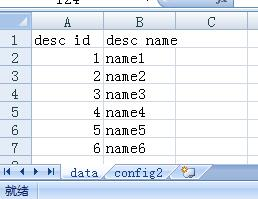

# Excel to Mysql
parse excel file data to mysql driver

# config path
The config file is must in the bin directory.

File name is "config.json" or as same as exe name.

# config example

>[{"host":"0.0.0.0","port":3306,"user":"root","password":"","database":"dbname","desc":"描述","charset":"utf8","hookUrl":""}]

Use hook to execute clearing up the caches and any other operations after update the data.

# excel example

Data sheet must be named sheet1 or data!

Row one is the desc name and corresponding to the MySQL field of config2's sheet.

Config sheet must be named config2!

Row 1 of config2 sheet is the table name.

Cell 1 is the mysql field name. Cell 2 is the data sheet's desc field name.

# how to use it

You can drag one or some excel files to window and click the run button!

# how to read data row from excel with more than 255 chars?

You just need to Run Regedit and go to :

32-bits versions:

>HKEY_LOCAL_MACHINE\SOFTWARE\Microsoft\Jet\4.0\Engines\Excel

Or

64-bits versions:

>HKEY_LOCAL_MACHINE\SOFTWARE\wow6432node\microsoft\jet\4.0\Engines\Excel

There, change the TypeGuessRows to 0, so the Jet engine will use all the rows to set the data type.
